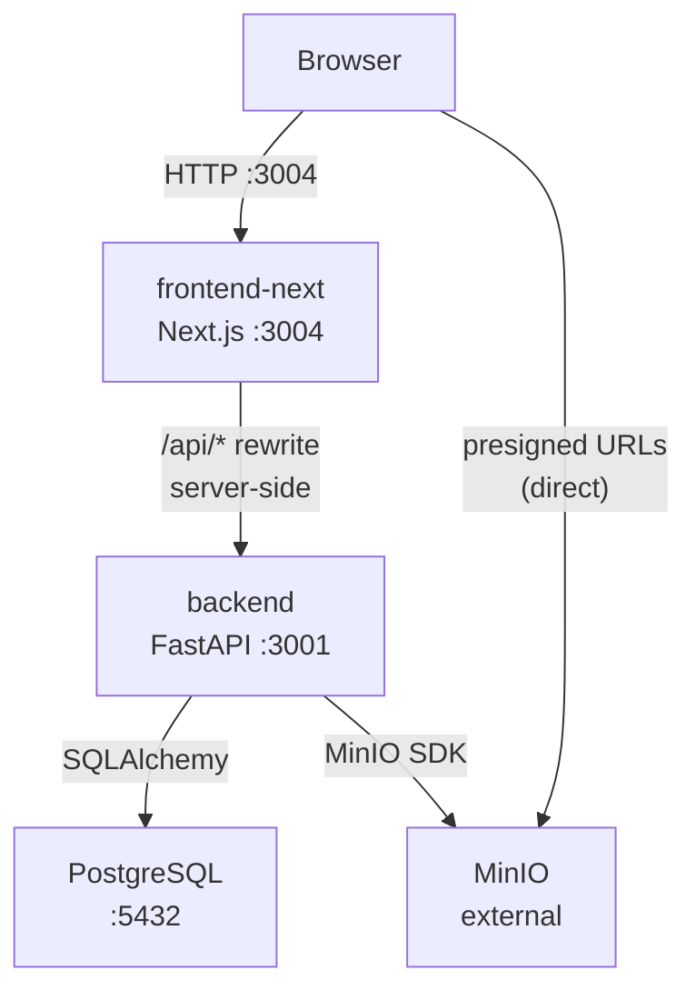
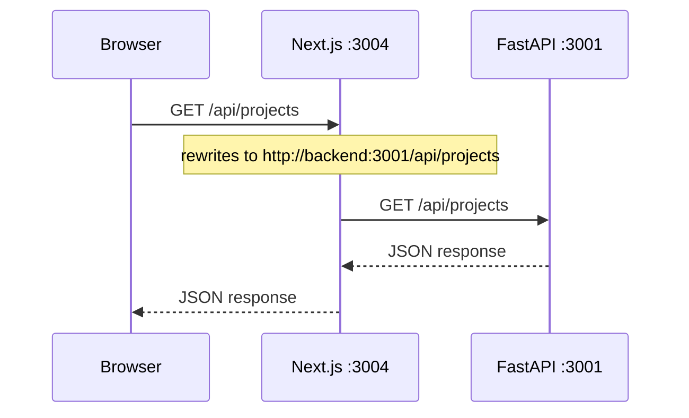
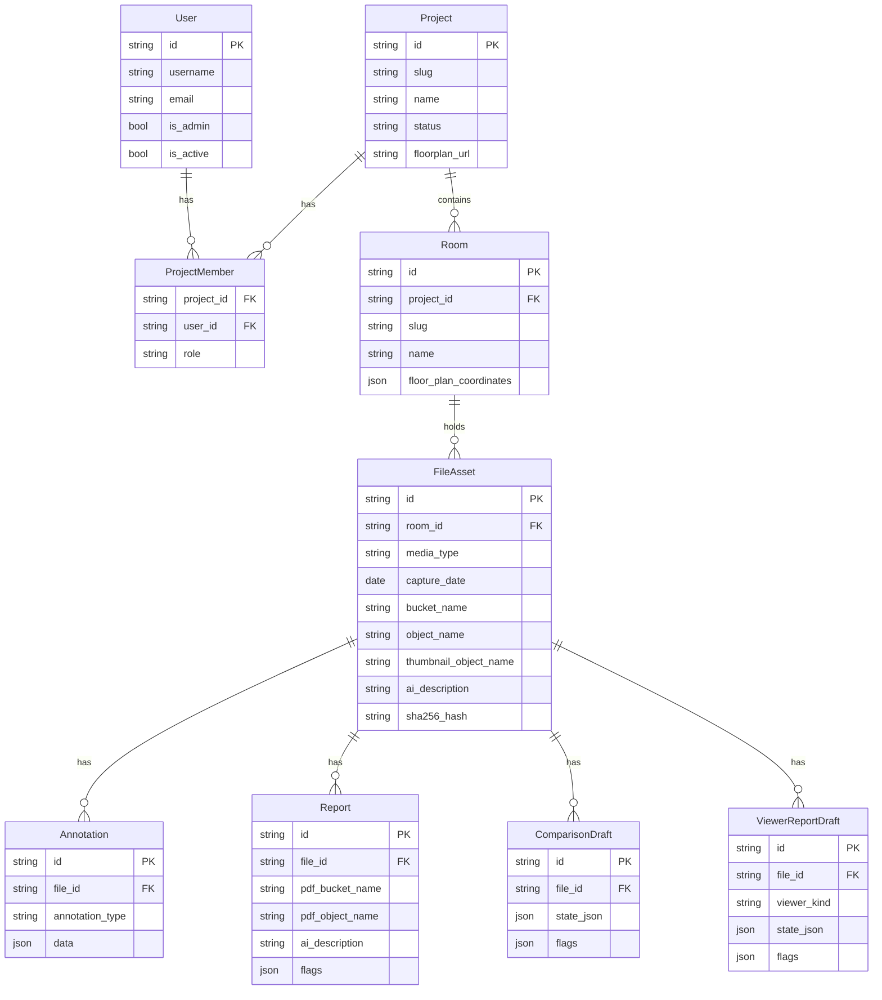

# SiteScope: Architecture

This document covers how the three repos fit together at runtime: topology, the API proxy, networking, and the cross-cutting data model. For per-feature deep dives (auth, files, AI, reports) see the topic-based map in [PROJECT_OVERVIEW.md](PROJECT_OVERVIEW.md). For setup instructions see [README.md](README.md).

## System overview




The browser never sees the backend's internal address. All `/api/*` requests go to the Next.js server, which rewrites them server-side to the backend. MinIO is the only service the browser contacts directly for file downloads via presigned URLs.

## Repos and responsibilities


| Repo            | Runtime role                                               | Key config                     |
| --------------- | ---------------------------------------------------------- | ------------------------------ |
| `backend`       | FastAPI app, business logic, DB access, file orchestration | `.env` DB, MinIO, JWT, AI      |
| `frontend-next` | Next.js server + browser bundle, API proxy                 | `BACKEND_URL` build arg        |
| `deployment`    | Docker Compose orchestration                               | `.env` passed to both services |


## API proxy, why BACKEND_URL is a build arg




Next.js bakes rewrite destinations into `routes-manifest.json` at `npm run build` time. This means:

- `BACKEND_URL` must be set **before** `docker compose build`
- The browser bundle contains no reference to internal Docker hostnames
- No CORS configuration is needed between the browser and the backend
- Changing `BACKEND_URL` requires a frontend rebuild

For local dev outside Docker, `BACKEND_URL` defaults to `http://localhost:3002` (the backend container's mapped host port).

## Authentication & roles (at a glance)

Two independent layers of access control:

```
Global admin (User.is_admin)        — manage users + projects, upload anywhere, /api/admin/*
Project membership (project_members.role)
  ├── owner   — manage project settings and members
  ├── editor  — create annotations and reports, upload files
  └── viewer  — read-only access
```

Admins bypass project membership and have implicit access to all projects. The first registered user is automatically `is_admin = True`. JWTs are HS256 / 7-day lifetime, stored in browser `localStorage` under `a6_auth_v2`, cleared on logout or any 401.

**For the full picture see:**

- Token issuance, email verification, password reset: `[backend/AUTH_AND_EMAIL.md](../backend/AUTH_AND_EMAIL.md)`
- Per-endpoint authorization matrix (every route × every role): `[backend/PERMISSIONS.md](../backend/PERMISSIONS.md)`
- Frontend session handling, 401 → /login flow: `[frontend-next/AUTH_FLOWS.md](../frontend-next/AUTH_FLOWS.md)`

## Data model




`media_type` on `FileAsset` is one of: `image`, `video`, `pointcloud`, `pdf`.

## Object storage (MinIO)

MinIO is external to the Docker Compose stack. The backend manages all six buckets and creates them on first startup.

```
MinIO
├── construction-images        ← uploaded images (original)
├── construction-thumbnails    ← auto-generated thumbnails (400×300, quality 82)
├── construction-pointclouds   ← LAZ originals + Potree-converted output (_potree/ prefix)
├── construction-pdfs          ← uploaded PDF documents
├── construction-reports       ← generated report PDFs
└── construction-floorplans    ← project floor plan images
```

The browser accesses files via **presigned URLs** (7-day expiry) returned by the API. The browser PUT-uploads point clouds directly to MinIO using a presigned URL, bypassing the Next.js proxy for large files.

## Application pipelines (pointers)

Each major feature pipeline lives in its own deep-dive doc. Quick orientation:

- **File uploads & point-cloud conversion**: two upload paths (direct presigned PUT, chunked through the proxy), SHA-256 duplicate detection, async PotreeConverter worker pool (2 workers, 32 MB chunks). PotreeConverter is a pre-built Linux binary installed in the backend Docker image at build time. Full sequence diagrams, lifecycle states, and retry semantics in `[backend/FILES.md](../backend/FILES.md)`.
- **AI image analysis**: `POST /api/ai/analyze` with a two-layer cache (per-asset DB row + in-memory dict). OpenAI-compatible vision API (local Ollama or Hyperbolic cloud); degrades gracefully if no model is reachable. Browser polls every 2s while a background analysis is in flight (202 response). Full prompt, cache semantics, and abuse-surface discussion in `[backend/AI.md](../backend/AI.md)`.
- **Reports**: client-side PDF generation with jsPDF; the backend stores finished blobs and records metadata. Two flavours: viewer reports (one file) and comparison reports (consolidate multiple drafts into one PDF via pdf-lib). Draft/publish lifecycle, `viewer_kind` enum, and PDF section toggles in `[backend/REPORTS.md](../backend/REPORTS.md)` (server side) and `[frontend-next/REPORTS.md](../frontend-next/REPORTS.md)` (PDF builder, draft UI). BPMN diagram at `[docs/bpmn/09-field-report.bpmn](../docs/bpmn/09-field-report.bpmn)`.

## Container networking

All services share the default Docker Compose network (`SiteScope_default` or similar). Internal service names resolve as hostnames:


| Internal hostname | Service    |
| ----------------- | ---------- |
| `db`              | PostgreSQL |
| `backend`         | FastAPI    |
| `frontend-next`   | Next.js    |


The backend hardcodes `DB_HOST=db` in the Compose file. The frontend uses `BACKEND_URL=http://backend:3001` baked at build time. No service communicates with another using host-port mappings, those exist only for external access.