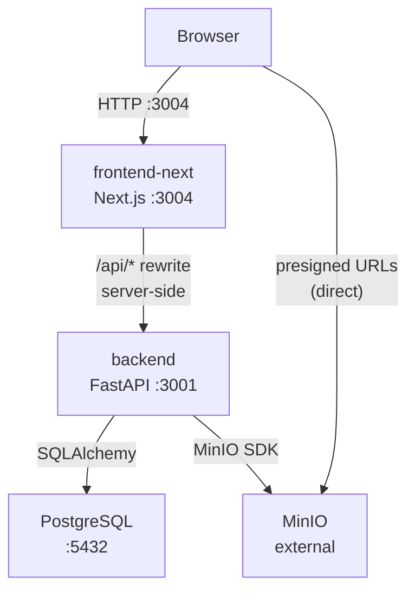
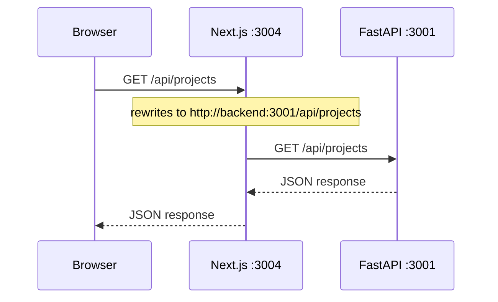
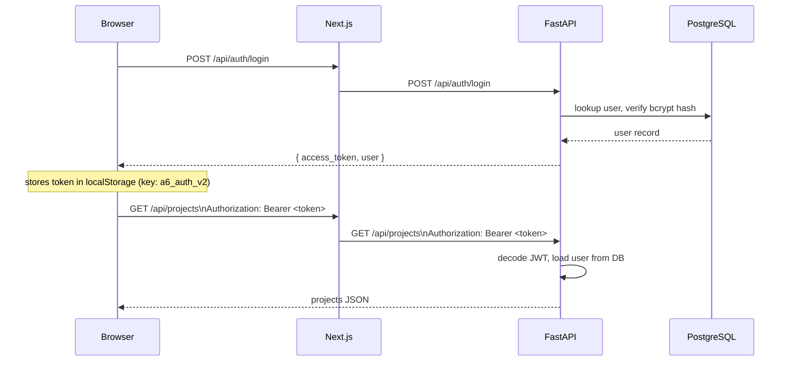
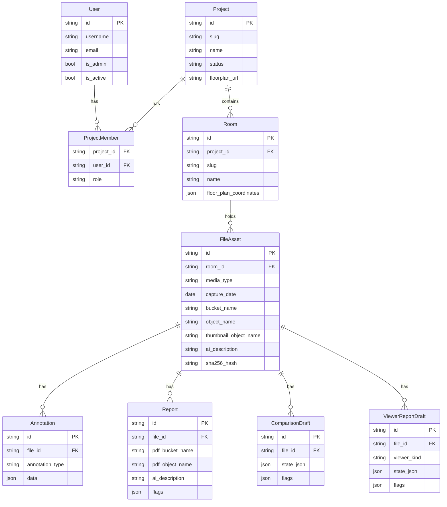
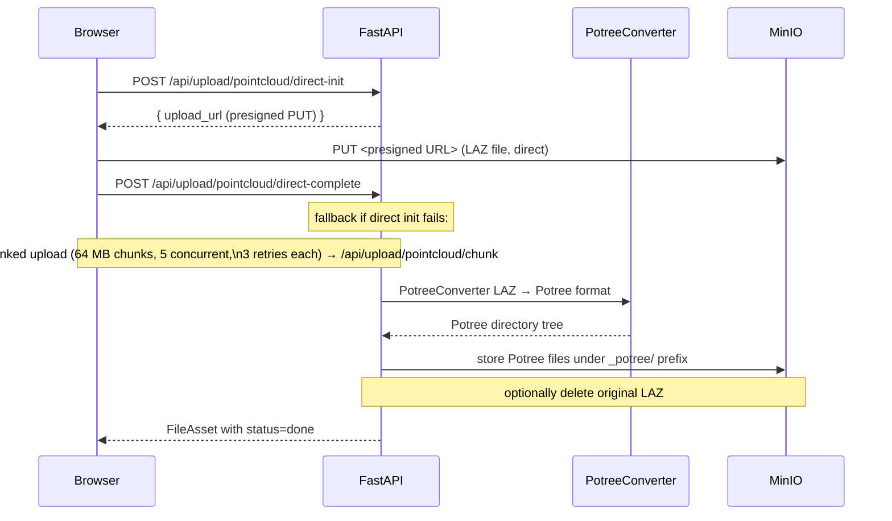
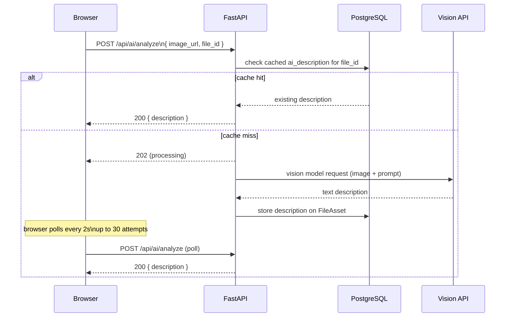

# A6-Stern — Architecture

This document covers how the three repos fit together at runtime. For setup instructions see [README.md](README.md).

## System overview




The browser never sees the backend's internal address. All `/api/*` requests go to the Next.js server, which rewrites them server-side to the backend. MinIO is the only service the browser contacts directly for file downloads via presigned URLs.

## Repos and responsibilities


| Repo            | Runtime role                                               | Key config                     |
| --------------- | ---------------------------------------------------------- | ------------------------------ |
| `backend`       | FastAPI app, business logic, DB access, file orchestration | `.env` DB, MinIO, JWT, AI      |
| `frontend-next` | Next.js server + browser bundle, API proxy                 | `BACKEND_URL` build arg        |
| `deployment`    | Docker Compose orchestration                               | `.env` passed to both services |


## API proxy, why BACKEND_URL is a build arg




Next.js bakes rewrite destinations into `routes-manifest.json` at `npm run build` time. This means:

- `BACKEND_URL` must be set **before** `docker compose build`
- The browser bundle contains no reference to internal Docker hostnames
- No CORS configuration is needed between the browser and the backend
- Changing `BACKEND_URL` requires a frontend rebuild

For local dev outside Docker, `BACKEND_URL` defaults to `http://localhost:3002` (the backend container's mapped host port).

## Authentication flow




**Token details:**

- Algorithm: HS256
- Lifetime: 7 days
- Storage: `localStorage` cleared on logout or 401 response
- No refresh token expired sessions redirect to `/login`
- First account registered is automatically granted admin rights

## Role system

Two independent layers of access control:

```
Global admin (User.is_admin)
├── Manage all users and projects
├── Upload files to any project
└── Access /api/admin/* routes

Project membership (project_members.role)
├── owner   — manage project settings and members
├── editor  — create annotations and reports
└── viewer  — read-only access
```

Admins bypass project membership checks and have implicit access to all projects.

## Data model




`media_type` on `FileAsset` is one of: `image`, `video`, `pointcloud`, `pdf`.

## Object storage (MinIO)

MinIO is external to the Docker Compose stack. The backend manages all six buckets and creates them on first startup.

```
MinIO
├── construction-images        ← uploaded images (original)
├── construction-thumbnails    ← auto-generated thumbnails (400×300, quality 82)
├── construction-pointclouds   ← LAZ originals + Potree-converted output (_potree/ prefix)
├── construction-pdfs          ← uploaded PDF documents
├── construction-reports       ← generated report PDFs
└── construction-floorplans    ← project floor plan images
```

The browser accesses files via **presigned URLs** (7-day expiry) returned by the API. The browser PUT-uploads point clouds directly to MinIO using a presigned URL, bypassing the Next.js proxy for large files.

## Point cloud pipeline




PotreeConverter is a pre-built Linux binary installed in the backend Docker image at build time. Two concurrent conversion workers run as a background pool; uploaded files queue if both workers are busy.

## AI image analysis pipeline




The vision API is OpenAI-compatible. Supports local Ollama models (no key needed) or the Hyperbolic cloud API (`VISION_API_KEY`). The feature degrades gracefully all other functionality is unaffected if no model is reachable.

## Report generation

Reports are generated client-side in the browser using **jsPDF**, then uploaded as finished PDF blobs to the backend. The backend stores them in MinIO and records metadata in PostgreSQL.

Two report types:

- **Viewer report** field observation from any viewer (panorama, point cloud, static image, PDF). Saved as a draft (`ViewerReportDraft`), then published as a `Report`.
- **Comparison report** side-by-side image comparison with annotations. Saved as `ComparisonDraft` entries, consolidated and published together.

## Container networking

All services share the default Docker Compose network (`a6-stern_default` or similar). Internal service names resolve as hostnames:


| Internal hostname | Service    |
| ----------------- | ---------- |
| `db`              | PostgreSQL |
| `backend`         | FastAPI    |
| `frontend-next`   | Next.js    |


The backend hardcodes `DB_HOST=db` in the Compose file. The frontend uses `BACKEND_URL=http://backend:3001` baked at build time. No service communicates with another using host-port mappings — those exist only for external access.